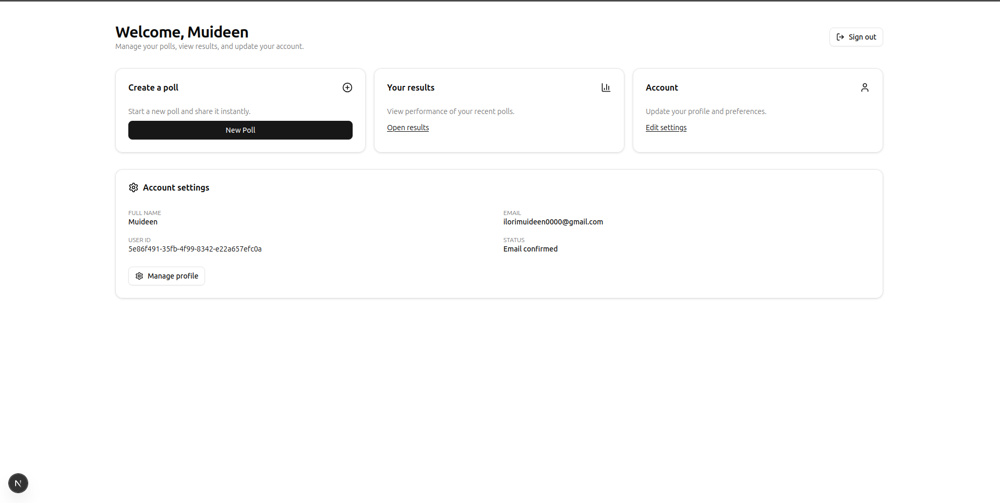

# polling-app
# Next.js Polling App - Complete Setup Guide

This guide provides end-to-end prompts to recreate a polling application from scratch using Next.js (App Router) and Tailwind CSS. Follow these steps in order, with each prompt assuming a fresh project setup.

## Screenshots

Place the images in `polling-app/public/screenshots/` with the exact filenames below so they render on GitHub.

- Home



- Login


- Register


- Dashboard


## Prompts and AI Responses (Representative)

Below are condensed examples of the prompts used during this build and the assistant’s responses/actions. They’re grouped by milestone with links to the affected files.

### Landing page redesign
- **Prompt:** “Professionally recreate the homepage with a top bar (Polling App left, Get Started right) and a modern hero.”
- **AI response/outcome:** Implemented nav + hero with vector illustration and feature highlights.
  - Files: `src/app/page.tsx`, `app/globals.css`

### Auth provider + Supabase
- **Prompt:** “Create an auth provider with Supabase: signIn, signUp, signOut; manage session and auth state changes.”
- **AI response/outcome:** Added `AuthProvider` with `getSession`, `onAuthStateChange`, metadata on signUp, and robust error logging.
  - Files: `src/lib/auth-provider.tsx`, `src/lib/supabase-browser.ts`

### Register form (UX + validation)
- **Prompt:** “Build a professional register form with RHF + Zod, strength meter, visibility toggles, and terms acceptance.”
- **AI response/outcome:** Implemented fields, `superRefine` validations, strength meter, and polished UI. Clear messaging for ‘email already registered’.
  - File: `src/components/RegisterForm.tsx`

### Login form (UX + resend confirmation)
- **Prompt:** “Build a professional login form with remember‑me, password toggle, and a ‘Resend confirmation’ action.”
- **AI response/outcome:** Added resend via `supabase.auth.resend`, improved errors, and redirect to dashboard on success.
  - File: `src/components/LoginForm.tsx`

### Checkbox compatibility
- **Prompt:** “Create a checkbox component and ensure RHF compatibility.”
- **AI response/outcome:** Added `ui/checkbox` and also used native checkbox where needed for reliable RHF wiring.
  - File: `src/components/ui/checkbox.tsx`

### Dashboard
- **Prompt:** “Recreate `/dashboard` professionally; greet with full name from metadata; quick actions and account settings.”
- **AI response/outcome:** Personalized greeting, quick action cards, account details (name, email, user id, status), and sign‑out.
  - File: `src/app/dashboard/page.tsx`

### Email delivery + environment
- **Prompt:** “Diagnose confirmation email issues; support both built‑in email and custom SMTP.”
- **AI response/outcome:** Added resend flow; documented Supabase Auth URL config and SMTP steps; ensured `.env.local` single‑line keys.
  - Files: `README.md`, `.env.local` (user‑provided)

### Commit & push
- **Prompt:** “Generate a meaningful commit message and push to `feat/auth`.”
- **AI response/outcome:** Committed UI/auth changes, screenshots references; pushed branch.

> Tip: For a full conversation log, use your VCS platform or workspace history. This section captures the key prompts and their concrete outcomes.

## 1. Bootstrap Project

Create a Next.js 15 TypeScript app named polling-app with Tailwind CSS installed and configured for the App Router. Add eslint, typescript, and tailwind v4. Set up src/ structure and app/ directory.

## 2. Install Dependencies

Add these deps and devDeps: 
- **Dependencies:** `@supabase/supabase-js`, `react-hook-form`, `zod`, `@hookform/resolvers`, `lucide-react`, `react-hot-toast`, `class-variance-authority`, `clsx`, `tailwind-merge`
- **Dev Dependencies:** `eslint@^9`, `eslint-config-next@15`, `@types/node`, `@types/react`, `@types/react-dom`

## 3. Tailwind and Design System

Configure Tailwind v4 in `app/globals.css` with CSS variables for colors, radii, and dark mode. Add base, components, utilities layers and a modern neutral theme. Ensure body uses `bg-background` and `text-foreground`.

## 4. UI Primitives

Create reusable UI components in `src/components/ui`: `button.tsx`, `card.tsx`, `input.tsx`, `label.tsx`, `form.tsx`. Follow shadcn-like API with cn helper from `src/lib/utils.ts`. Include focus rings, disabled states, and variants.

## 5. Supabase Client (Browser)

Create `src/lib/supabase-browser.ts` exporting a supabase client from `@supabase/supabase-js` using `NEXT_PUBLIC_SUPABASE_URL` and `NEXT_PUBLIC_SUPABASE_ANON_KEY`. Enable `persistSession`, `autoRefreshToken`, `detectSessionInUrl`.

## 6. Auth Context/Provider

Implement `src/lib/auth-provider.tsx` as a client component with React context:

### Features:
- **State:** `user`, `loading`
- **Methods:** `signIn(email, password)`, `signUp(email, password, name?)`, `resendConfirmation(email)`, `signOut()`

### Implementation Details:
- On mount, call `supabase.auth.getSession()`; subscribe to `onAuthStateChange` and set user
- `signIn` uses `signInWithPassword`, returns `{error?, user?}`
- `signUp` calls `supabase.auth.signUp` with metadata `{full_name, name}`, returns `{user?, immediateSignIn?, message?}` based on whether session exists
- `resendConfirmation` uses `supabase.auth.resend({ type: 'signup', email })`
- Export `useAuth()` hook

## 7. App Layout

Wrap children with `AuthProvider` and mount `<Toaster />` in `src/app/layout.tsx`. Set site metadata title/description.

## 8. Homepage (Professional Hero + Nav)

Replace `src/app/page.tsx` with a modern landing:
- **Top nav:** brand left, 'Get Started' right
- **Hero section:** split layout (left vector/illustration using Tailwind shapes and Lucide icons; right headline, subcopy, CTAs)
- **Features:** 3-card feature row

## 9. Auth Pages: Routes and Shells

Create `src/app/auth/register/page.tsx` and `src/app/auth/login/page.tsx` with gradient background, back link to home, centered card containing respective forms.

## 10. Forms: Register

Build `src/components/RegisterForm.tsx` with React Hook Form + zod:

### Fields:
- Full name, email, password, confirm password, acceptTerms

### Features:
- Password strength meter and visibility toggles
- Icons in inputs

### Validation:
- Name ≥ 2 characters
- Email format validation
- Password min 8 + uppercase/lowercase/number
- Confirm password match
- acceptTerms required (use superRefine)

### Submit Logic:
- Call `signUp(email, password, name)`
- If `immediateSignIn`, toast success then push `/dashboard`
- Else toast 'check your email' then push login
- Handle 'email already registered' by showing specific message to sign in or resend confirmation

## 11. Forms: Login

Build `src/components/LoginForm.tsx` with RHF + zod:

### Fields:
- Email, password, rememberMe
- Password visibility toggle and icons

### Submit Logic:
- Call `signIn`, toast success, delay 1.5s, push `/dashboard`
- Add small link 'Didn't get the email? Resend confirmation' that reads typed email and calls `resendConfirmation(email)` with toasts

## 12. Checkbox Utility

Add `src/components/ui/checkbox.tsx` (Radix or native). If using native, wire it with RHF via `checked` + `onChange`.

## 13. Dashboard (Professional)

Recreate `src/app/dashboard/page.tsx` as a client page:

### Features:
- Read user from `useAuth()`
- Extract full name from `user.user_metadata.full_name || name`
- **Header:** greeting with name; sign-out button
- **Quick actions grid:** Create Poll, Results, Account
- **Account settings card:** showing full name, email, user id (mono), and email confirmation status
- **Links:** for New Poll, Results, Edit settings (stub routes)

## 14. Toasts and Feedback

Use `react-hot-toast` for all operations (create success/error messages and loading states).

## 15. Environment

Create `.env.local` with single-line values:
```env
NEXT_PUBLIC_SUPABASE_URL=...
NEXT_PUBLIC_SUPABASE_ANON_KEY=...
```
Restart the dev server after edits.

## 16. Supabase Auth Configuration

In Dashboard → Auth → Settings:
- Enable email confirmations
- **URL configuration:** Site URL `http://localhost:3000`; add to Additional Redirect URLs
- Use built-in email or configure Custom SMTP (Gmail: host `smtp.gmail.com`, port 587, STARTTLS, username = gmail, password = App Password)

## 17. Email Template Sanity Check

Auth → Emails → Templates → Confirm signup: 
- Ensure `{{ .ConfirmationURL }}` present
- Switch to Preview, use Send test to verify delivery (or invite user from Auth → Users to force a send)

## 18. Error Handling Polish

Log structured results in provider; surface professional messages for:
- Email already registered
- Invalid login credentials
- Resend confirmation result

## 19. Homepage Polish Iteration

Add subtle backdrop blur for nav, refine spacing, responsive grid breakpoints, and hero illustration floating icons.

## 20. Commit Message

Use: `feat(app): professional UI overhaul, robust auth flow, new dashboard…` with notes about env and SMTP.

## Final QA Prompts

### Test Coverage:
- Register happy path (email confirmation on)
- Resend flow
- Login redirect
- Dashboard render with fullName
- Sign out
- Dark/light visual scan
- Mobile breakpoints

### Verification:
- Verify `.env.local` keys are single-line
- Check Network → auth endpoints (signup 200/201; sign-in after confirm)

